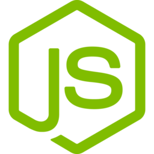
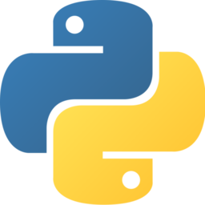
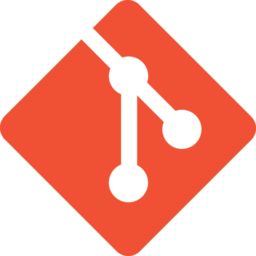
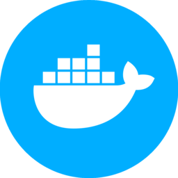
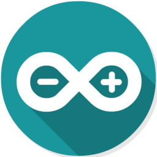
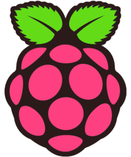

# Hi, I'm Lucas David 👋

## 🙋‍♂️ About Me

- 🔭 I'm currently looking for a job in Backend Development

- 🌱 I’m currently learning about NodeJS and TypeScript

- 🤔 I’m looking to collaborate on [StackOverflow](https://pt.stackoverflow.com/)

- 📫 How to reach me: 

  
  
  

 

## 🚀 Languages and Tools

  
  
  
  
  
  
  
  
  
  
  
  

 

## 📈 My Github Stats

  <a href="https://github.com/lucasdavidoj" target="_blank">
  
  

<!--
**lucasdavidoj/lucasdavidoj** is a ✨ _special_ ✨ repository because its `README.md` (this file) appears on your GitHub profile.

Here are some ideas to get you started:

- 🔭 I’m currently working on ...
- 🌱 I’m currently learning ...
- 👯 I’m looking to collaborate on ...
- 🤔 I’m looking for help with ...
- 💬 Ask me about ...

- 😄 Pronouns: ...
- ⚡ Fun fact: ...
-->
